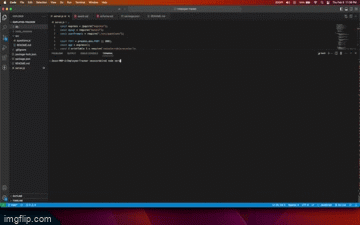
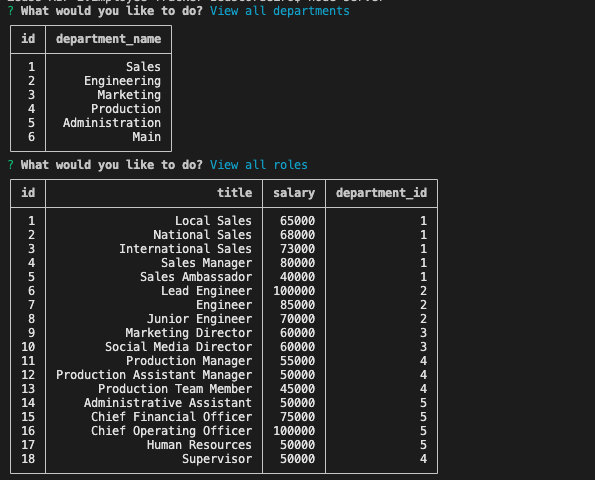

# Employee-Tracker

  ## Description:
  This app will help a business owner view and manage the departments, roles, and employees in their company so they can organize and plan their business.

  ## Table of Contents:
  - [Installation](#installation)
  - [Usage](#usage)
  - [License](#license)
  - [Contributions](#contributions)
  - [Published Page](#page)
  - [Repo](#repo)

 ## Installation
  Install all of the dependencies in the package.json file. Once that is done you should be able to run node on the 'server.js' file.

 ## Usage 
   Once you run node on the index file, it will prompt the user and create or show the appropriate departments, roles, and employees in their company.

 ## License 
  N/A

 ## Contributions 
  N/A

 ## Screen Shot
 

# LINKS

 ## Link to Google Drive Video 
  https://drive.google.com/file/d/16UIr7r9kvRpOUb8aQGEzGSJYifFFnoNa/view?usp=sharing

 ## Repo 
  https://github.com/Zcordeiro/Employee-Tracker

